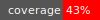
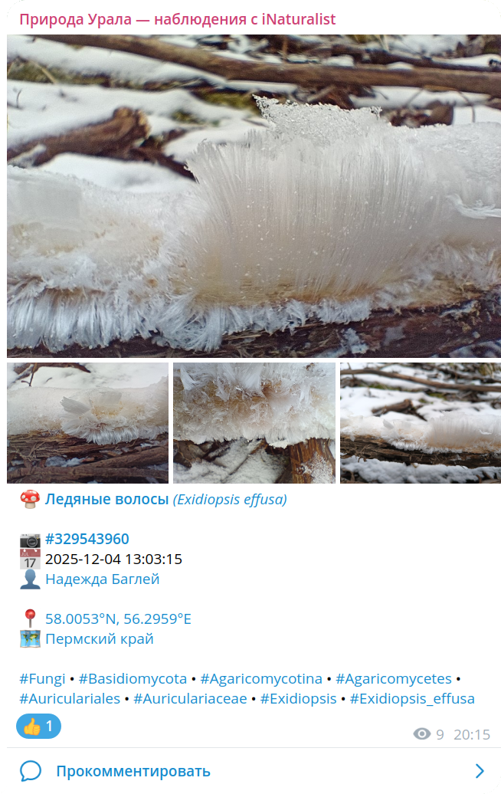

# inat-channel — automatic posting of observations

[](LICENSE)
[](https://badge.fury.io/rb/inat-channel)
[](https://github.com/inat-get/inat-channel/actions/workflows/ruby.yml) 


A script that sends a random iNaturalist observation from a selected sample to Telegram.

## What does it do?

+ Obtains a sample via the [iNaturalist API](https://api.inaturalist.org/v2/docs/#/Observations/get_observations) based on an arbitrary query (supported by the API).

+ Sends a random observation from the sample to a specified Telegram channel, excluding those already sent. If there are no new observations in the fresh sample, it takes from a saved pool.

+ Saves unsent observations obtained via the query into the pool.

+ Taxon uniqueness and pool depth are configurable.

+ Sends a message to the administrator in case of failures.

## Installation and running

### Using Bundler

Create a `Gemfile` with the single line:
```
gem 'inat-channel', '~> 0.9.0'
```

Run:
```
$ bundle install
```

Then use:
```
$ bundle exec inat-channel [options]
```

### Manually

Install:
```
$ gem install inat-channel
```

Run:
```
$ inat-channel [options]
```

There are few command line parameters, and all are optional:

```
$ inat-channel --help
Usage: inat-channel [options]
    -c, --config FILE                Config file (default: inat-channel.yml)
    -l, --log-level LEVEL            Log level (default: warn)
        --debug                      Set log level to debug
        --version                    Show version info and exit
    -h, --help                       Show help and exit
```

## Configuration

Main settings are described in a YAML configuration file. Optionally, you can specify an ERB message template and extract the `places` group of settings (see below) into a separate YAML file.

Most settings have default values and may be omitted, but some are mandatory.

### Environment variables

Additionally, **two mandatory parameters** must be set **in environment variables**: `TELEGRAM_BOT_TOKEN` is responsible for the Telegram bot token,
which is issued during creation via [@BotFather](https://t.me/BotFather) — you need to add this bot (your bot) to your channel as an admin
and give it rights to post messages; in the `ADMIN_TELEGRAM_ID` variable, specify your personal ID — notifications will be sent to it.
You can find this ID using the bot [@Getmyid_bot](https://t.me/Getmyid_bot). These parameters cannot be set in the config file for security reasons.

### Configuration file

Example:
```
base_query:
  project_id: 175821
  locale: ru
  popular: true
  photo_license: 'cc-by,cc-by-nc,cc-by-nd,cc-by-sa,cc-by-nc-nd,cc-by-nc-sa,cc0'
  quality_grade: research
  
days_back:
  fresh: 30
  pool: 180
  sent: 181
  used: 360
  
unique_taxon: priority


lock_file:
  path: data/data.lock
  ttl: 300
  
data_files:
  root: data
  pool: data/pool.json
  sent: data/sent.json
  used: data/used.json
  
api:
  retries: 5
  interval: 1.0
  randomness: 0.5
  backoff: 2
  page_delay: 1.0
  per_page: 200
  
tg_bot:
  retries: 5
  interval: 1.0
  randomness: 0.5
  backoff: 2
  chat_id: '@<my_test_channel>'
  template: message.erb
  desc_limit: 512
  link_zoom: 12
  
log_level: info
notify_level: warn


places: places.yml
```

This is a fully working (if you fix `tg_bot.chat_id`) but somewhat verbose config. Let's break down the parameters.

#### API query parameters

```
base_query:
  project_id: 175821
  locale: ru
  popular: true
  photo_license: 'cc-by,cc-by-nc,cc-by-nd,cc-by-sa,cc-by-nc-nd,cc-by-nc-sa,cc0'
  quality_grade: research
```

The composition of these parameters can be arbitrary but at least one must be specified. Some notes:

+ As `project_id` you can specify not only a numeric ID but also the project `slug`, which is easier to obtain — part of its URL.

+ Locale affects taxon names; without it, English names are returned.

+ *It is strongly recommended to specify photo licenses*, otherwise the script may collect observations whose photos you do not have rights to redistribute.

+ Observations on iNaturalist vary in quality. The parameters `quality_grade: research` and `popular: true` do not guarantee anything but tend to improve the sample on average.

#### Recency parameters

```
days_back:
  fresh: 30
  pool: 180
  sent: 181
  used: 360

unique_taxon: priority
```

Group of parameters controlling recency and data lifetime.

+ `days_back.fresh` is *mandatory* and defines how many days of data are requested each run.
  You might want to reduce it according to the script run frequency, but keep in mind that to achieve `research` status,
  and especially to be counted as popular (means at least one user favorited the observation), some extra time is needed.
  Though 30 days may be too much, at least a week is recommended.

+ `days_back.pool` controls the age of observations in the pool. The pool is used if no fresh observations are available or all are already sent.
  Observations older (in days) than this are removed from the pool. Default is `days_back.fresh * 3`. This parameter also controls initial pool fill on first run.

+ `days_back.sent` controls how long the list of sent observations is kept. Age is counted from the send date. It is recommended to set it equal 
   to `days_back.pool` or one day more, to avoid duplicates (they shouldn't get into the pool but just in case...). Default is `days_back.pool + 1`.

+ `days_back.used` controls how long information about *used taxa* is kept. Default is `365` days (1 year).

+ `unique_taxon` manages taxon uniqueness. Possible values:

  + `strict` — observations with the same taxon are not sent (and removed from pool);

  + `priority` — observations with taxa never sent before get priority;

  + `ignore` — uniqueness is ignored; taxon data is not saved.

Default is `ignore`.

#### File parameters

Data is stored across runs in several JSON files. Also, to avoid concurrent runs corrupting data, parallel execution is forbidden, controlled by a lock file.

```
lock_file:
  path: data/data.lock
  ttl: 300
  
data_files:
  root: data
  pool: data/pool.json
  sent: data/sent.json
  used: data/used.json
```

The `lock_file` group defines the lock file name and its TTL in seconds — after that, the lock file is considered expired, allowing a new run. This prevents permanent blocking in case of crashes (though most errors should delete the lock file anyway).

The `data_files` group sets data file locations. `data_files.root` can specify a root folder for all data files without individual paths. In the example, `root` is unused since absolute paths are given.

#### Service parameters

```
api:
  retries: 5
  interval: 1.0
  randomness: 0.5
  backoff: 2
  page_delay: 1.0
  per_page: 200
  
tg_bot:
  retries: 5
  interval: 1.0
  randomness: 0.5
  backoff: 2
  chat_id: '@<my_test_channel>'
  template: message.erb
  desc_limit: 512
  link_zoom: 12
```  

These two groups control interaction with **[iNaturalist API v2](https://api.inaturalist.org/v2/docs/)** and **[Telegram Bot API](https://core.telegram.org/bots/api)**.

The first four keys in each group are identical and configure [`faraday-retry`](https://github.com/lostisland/faraday-retry), handling retries on errors. Defaults shown above can be changed for fine tuning but usually aren't needed.

iNaturalist API has rate limits; `api.page_delay` adds a delay between normal requests (not retries). Parameter `api.per_page` sets the number of items per request; 200 is the maximum. Adjust these only if iNaturalist changes API conditions.

Additional parameters in `tg_bot`:

+ `chat_id` — channel ID where messages will be sent.

+ `template` — [ERB](https://docs.ruby-lang.org/en/3.4/ERB.html) message template, explained below.

+ `desc_limit` — limits the `description` field length to fit Telegram limits. Reduce it if your template adds more text.

+ `link_zoom` — zoom level applied in map service links.

#### Logging and notifications

Two parameters:

```
log_level: info
notify_level: warn
```

+ `log_level` replicates command line `--log-level` (command line has priority).

+ `notify_level` similarly controls admin notification levels. Currently not implemented; notification cases are hardcoded.

#### Places

```
places: places.yml
```

In the example, places are extracted to a separate file. This is handy because place settings can be large and reusable across configs.

Example `places.yml` looks like:

```
regions:
  - place_ids: [ 139490 ]
    link: https://www.inaturalist.org/places/139490
    text: Sverdlovsk Oblast
    tag: SV
  - place_ids: [ 139365 ]
    link: https://www.inaturalist.org/places/139365
    text: Republic of Bashkortostan
    tag: BK
  - place_ids: [ 139506 ]
    link: https://www.inaturalist.org/places/139506
    text: Chelyabinsk Oblast
    tag: CL
  - place_ids: [ 139361 ]
    link: https://www.inaturalist.org/places/139361
    text: Perm Krai
    tag: PE
  - place_ids: [ 139358 ]
    link: https://www.inaturalist.org/places/139358
    text: Orenburg Oblast
    tag: OB
  - place_ids: [ 12867 ]
    link: https://www.inaturalist.org/places/12867
    text: Khanty-Mansi Autonomous Okrug
    tag: KM
  - place_ids: [ 11809 ]
    link: https://www.inaturalist.org/places/11809
    text: Komi Republic
    tag: KO
  - place_ids: [ 13219 ]
    link: https://www.inaturalist.org/places/13219
    text: Yamalo-Nenets Autonomous Okrug
    tag: YN
```

A few words on why this is needed. iNaturalist defines many territories, each observation belongs to several. These places vary in quality and purpose of tagging, so it's uninteresting to show them all. But some are worth highlighting. For that, we specify a selected list.

The list is split into groups. The example has one group — `regions`, but there can be several: e.g., one for administrative/municipal units, another for protected areas, parks, etc. Options vary.

The script iterates over this list and, if it finds an intersection between the observation's `place_ids` and the list's `place_ids`, it adds a corresponding item (with `link`, `text`, and `tag`) internally for the template. From each group, only one place max is added; groups are independent. So the max places listed equals the number of groups configured.

If you do not use a separate file, the whole structure should be nested under the `places` parameter with proper indentation.

## Message template

As mentioned, you can specify an ERB message template in the config. If not provided, a builtin default template is used:

```
<%= taxon.icon %> <a href="<%= taxon.url %>"><%= taxon.title %></a>


<%= observation.icon %> <%= observation.url %>
<%= datetime.icon %> <%= datetime %>
<%= user.icon %> <a href="<%= user.url %>"><%= user.title %></a>
<% if observation.description -%>
<blockquote><%= observation.description.text %></blockquote>
<% end -%>


<%= location.icon %> <%= location.dms %> -  <a href="<%= location.google %>">G</a> <a href="<%= location.osm %>">OSM</a>
<% if places && places.size > 0 -%>
<%   places.each do |place| -%>
<%= place.icon %> <a href="<%= place.link %>"><%= place.text %></a> <%= '• #' + place.tag if place.tag %>
<%   end -%>
<% else -%>
<%= icons[:place] %> <%= observation.place_guess %>
<% end -%>


<%= taxon.to_tags&.join(' • ') %>
```

[](example.png)

This template uses many emojis, which may look gaudy but makes it language-independent. You will most likely want to use your own template for your channel.
[An example](https://github.com/inat-get/channel-ural/blob/main/message.erb) is available in the [`channel-ural`](https://github.com/inat-get/channel-ural) project.

The template variables (standard or immutable data classes) are:

+ `observation`: `Observation`  
+ `datetime`: `DateTime` = `observation.datetime`  
+ `date`: `Date` = `observation.date` (= `datetime.to_date`)  
+ `location`: `Location` = `observation.location`  
+ `places`: `Array<Place>` = `observation.places`  
+ `taxon`: `Taxon` = `observation.taxon`  
+ `user`: `User` = `observation.user`  
+ `icons`: `Hash` — emoji set for icons  
+ `taxa_icons`: `Hash` — emoji set for taxon icons, selected bottom-up by hierarchy  
+ `data`: `Hash` — template data — you can specify front-matter in YAML format for your custom template, passed here; you can also override `icons` and `taxa_icons`.  
+ `config`: `Hash` — configuration data

Data class definitions are in [`data_types.rb`](https://github.com/inat-get/inat-channel/blob/next/lib/inat-channel/data_types.rb).

## Usage example

The script fully supports GitHub Actions. See how it works in the [`inat-get/channel-ural`](https://github.com/inat-get/channel-ural) project.
It contains four configs and four workflows that run them, to post different observation categories at different times.

## Version

+ **0.9.0** can be considered a beta or pre-release version. After some improvements, version 1.0 will be released.

## License

+ **[GNU GPL v3+](LICENSE)**,

